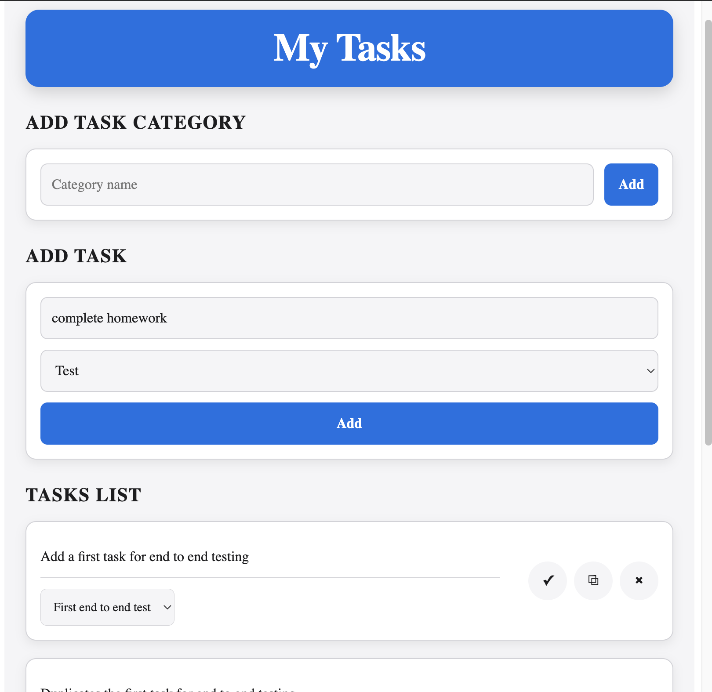

# Todo App

## Overview

Todo App is a full-stack task management application that allows users to create and manage tasks, organise them into categories, and update or delete existing tasks.

The project was built to strengthen my full-stack development skills by working with React and TypeScript on the frontend, Spring Boot on the backend, MySQL for data persistence, REST APIs, form validation, and asynchronous data management.

## Screenshot



## Features

- Add new task categories
- Add new tasks and assign them to a category
- Update task names and categories
- Delete tasks
- Display tasks organised by category
- Persistent data storage using MySQL
- REST API for managing categories and todos
- Form validation with Zod
- API state management with React Query
- Responsive styling using SCSS

## Built With

### Frontend

- React
- TypeScript
- Vite
- React Query
- React Hook Form
- Zod
- SCSS Modules

### Backend

- Java
- Spring Boot
- Spring Data JPA
- MySQL
- REST API

## Key Concepts

### Frontend

- React components
- Props
- State management
- Custom hooks
- TypeScript types
- React Query
- API requests
- Mutations and query invalidation
- React Hook Form
- Schema validation with Zod
- Conditional rendering

### Backend

- RESTful API design
- Controllers
- Services
- Repositories
- Entities
- DTOs
- Model mapping
- JPA relationships
- CRUD operations
- MySQL database relationships
- HTTP status codes

## How It Works

1. The user creates a category for their tasks.
2. The category is sent to the Spring Boot API and stored in MySQL.
3. The user creates a todo and assigns it to an existing category.
4. The frontend sends the todo data to the API.
5. The API stores the todo and its relationship with the category in the database.
6. React Query retrieves and manages the todo and category data.
7. Users can update a todo's name or category.
8. Users can delete todos when they are no longer needed.

## API Endpoints

### Categories

- `GET /categories` — retrieve all categories
- `POST /categories` — create a category
- `PATCH /categories/:id` — update a category
- `DELETE /categories/:id` — delete a category

### Todos

- `GET /todos` — retrieve all todos
- `GET /todos/:id` — retrieve a specific todo
- `POST /todos` — create a todo
- `PATCH /todos/:id` — update a todo
- `DELETE /todos/:id` — delete a todo

## Database Structure

The application uses separate database tables for **categories** and **todos**.

Each todo is associated with a category through a foreign-key relationship.

```text
Category
│
├── id
└── name
      │
      └── Todo
          ├── id
          ├── name
          └── category_id
```

## Testing

Testing is planned as a future improvement using:

- Vitest
- React Testing Library
- Jest DOM
- User Event

## Future Improvements

- Filter todos by category
- Add a task summary showing the number of todos in each category
- Add the ability to update and delete categories
- Implement soft deletion using an `isArchived` field
- Add authentication and user accounts
- Improve API error handling
- Add additional backend integration tests

---

This project was completed as part of the **\_nology Software Engineering program**.
